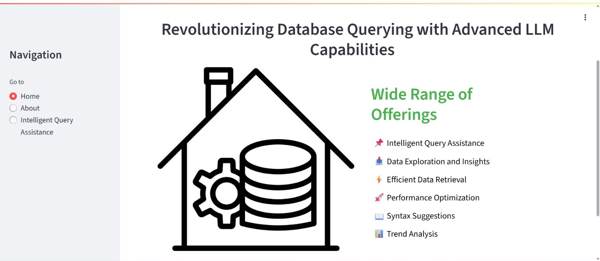
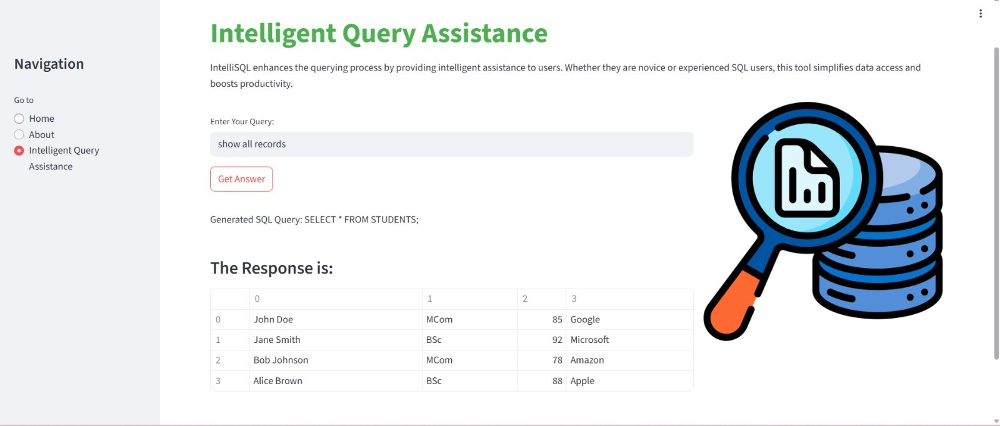

# 💡 IntelliSQL

IntelliSQL is an interactive tool that revolutionizes the way users interact with databases. It translates natural language questions into SQL queries using Google’s Gemini LLM, allowing users—both technical and non-technical—to retrieve meaningful data effortlessly.

---

## 🌟 Features

- 🔄 **Natural Language to SQL Conversion**
- 📦 **SQLite Integration with Preloaded Data**
- ⚙️ **LLM-based Query Generation (Gemini API)**
- 📊 **Instant Query Results Display**
- 🧠 **Zero SQL Knowledge Required**
- 🖼️ **User-Friendly Streamlit Interface**

---

## 📷 Screenshots

### 🏠 Home Page  


---

### ℹ️ About Section  


---

### 🤖 Intelligent Query Assistance  


---

## 🔧 Tech Stack

| Tech              | Purpose                          |
|-------------------|----------------------------------|
| **Python**        | Core programming language        |
| **Streamlit**     | Web interface framework          |
| **SQLite**        | Lightweight embedded database    |
| **Google Gemini** | LLM for natural language parsing |
| **pyngrok**       | Public link to the local app     |

---

## ⚙️ Installation

```bash
# Clone the repo
git clone https://github.com/BIPASHA-VIJAYANAND/intellisql.git
cd intellisql

# Install required packages
pip install streamlit google-generativeai pyngrok

# (Optional) Create your SQLite database (already created in script)

